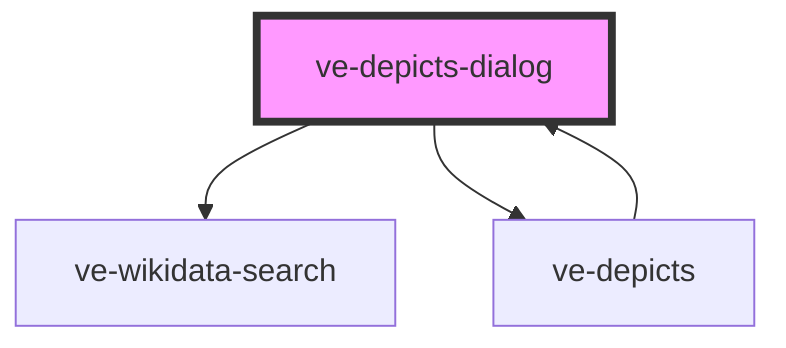

# ve-entities

<!-- Auto Generated Below -->

## Properties

| Property    | Attribute    | Description | Type      | Default     |
| ----------- | ------------ | ----------- | --------- | ----------- |
| `depicted`  | --           |             | `any[]`   | `[]`        |
| `imageHash` | `image-hash` |             | `string`  | `undefined` |
| `label`     | `label`      |             | `string`  | `undefined` |
| `show`      | `show`       |             | `boolean` | `false`     |
| `source`    | `source`     |             | `string`  | `undefined` |
| `sourceId`  | `source-id`  |             | `string`  | `undefined` |
| `summary`   | `summary`    |             | `string`  | `undefined` |
| `thumbnail` | `thumbnail`  |             | `string`  | `undefined` |

## Events

| Event             | Description | Type               |
| ----------------- | ----------- | ------------------ |
| `depictedChanged` |             | `CustomEvent<any>` |

## Dependencies

### Used by

 - [ve-depicts](../ve-depicts)

### Depends on

- [ve-wikidata-search](../ve-wikidata-search)
- [ve-depicts](../ve-depicts)

### Graph

----------------------------------------------

*Built with [StencilJS](https://stenciljs.com/)*
