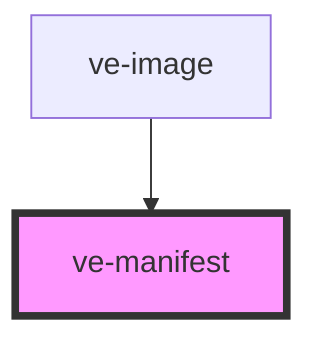

# ve-image-viewer

<!-- Auto Generated Below -->

## Properties

| Property    | Attribute   | Description | Type       | Default     |
| ----------- | ----------- | ----------- | ---------- | ----------- |
| `condensed` | `condensed` |             | `boolean`  | `false`     |
| `depicts`   | --          |             | `string[]` | `undefined` |
| `images`    | `images`    |             | `string`   | `undefined` |
| `src`       | `src`       |             | `string`   | `undefined` |

## Dependencies

### Used by

 - [ve-image](../ve-image)

### Graph

----------------------------------------------

*Built with [StencilJS](https://stenciljs.com/)*
