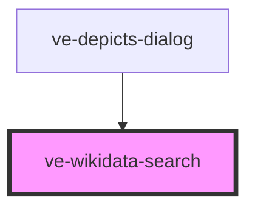

# ve-entities

<!-- Auto Generated Below -->

## Properties

| Property   | Attribute  | Description | Type     | Default |
| ---------- | ---------- | ----------- | -------- | ------- |
| `language` | `language` |             | `string` | `'en'`  |

## Events

| Event            | Description | Type               |
| ---------------- | ----------- | ------------------ |
| `entitySelected` |             | `CustomEvent<any>` |

## Dependencies

### Used by

 - [ve-depicts-dialog](../ve-depicts-dialog)

### Graph

----------------------------------------------

*Built with [StencilJS](https://stenciljs.com/)*
