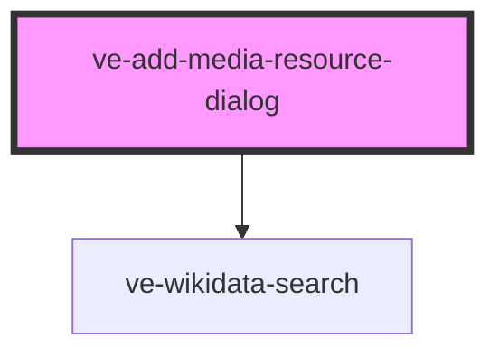

# ve-entities

<!-- Auto Generated Below -->

## Properties

| Property      | Attribute      | Description | Type      | Default     |
| ------------- | -------------- | ----------- | --------- | ----------- |
| `contentPath` | `content-path` |             | `string`  | `undefined` |
| `show`        | `show`         |             | `boolean` | `false`     |

## Dependencies

### Depends on

- [ve-wikidata-search](../ve-wikidata-search)

### Graph

----------------------------------------------

*Built with [StencilJS](https://stenciljs.com/)*
