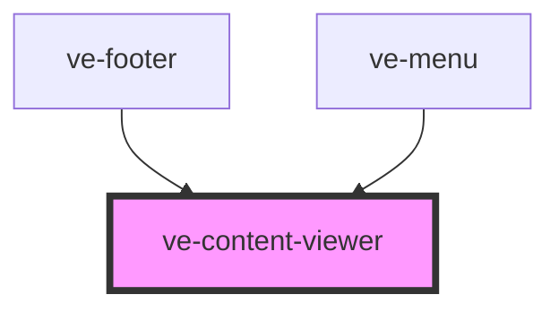

# ve-entities

<!-- Auto Generated Below -->

## Properties

| Property | Attribute | Description | Type      | Default     |
| -------- | --------- | ----------- | --------- | ----------- |
| `format` | `format`  |             | `string`  | `'html'`    |
| `path`   | `path`    |             | `string`  | `undefined` |
| `show`   | `show`    |             | `boolean` | `false`     |

## Dependencies

### Used by

 - [ve-footer](../ve-footer)
 - [ve-menu](../ve-menu)

### Graph

----------------------------------------------

*Built with [StencilJS](https://stenciljs.com/)*
