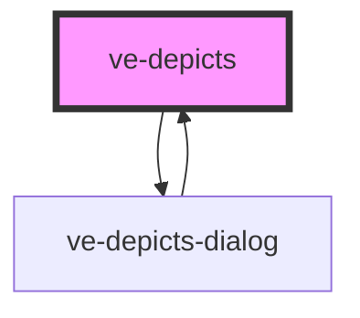

# ve-entities

<!-- Auto Generated Below -->

## Properties

| Property   | Attribute  | Description | Type      | Default     |
| ---------- | ---------- | ----------- | --------- | ----------- |
| `depicted` | --         |             | `any[]`   | `[]`        |
| `editable` | `editable` |             | `boolean` | `false`     |
| `format`   | `format`   |             | `string`  | `'default'` |
| `manifest` | `manifest` |             | `string`  | `undefined` |

## Events

| Event              | Description | Type               |
| ------------------ | ----------- | ------------------ |
| `droToggled`       |             | `CustomEvent<any>` |
| `entityRemoved`    |             | `CustomEvent<any>` |
| `prominentToggled` |             | `CustomEvent<any>` |

## Methods

### `edit() => Promise<void>`

#### Returns

Type: `Promise<void>`

### `refresh(depicted: any[]) => Promise<void>`

#### Returns

Type: `Promise<void>`

## Dependencies

### Used by

 - [ve-depicts-dialog](../ve-depicts-dialog)

### Depends on

- [ve-depicts-dialog](../ve-depicts-dialog)

### Graph

----------------------------------------------

*Built with [StencilJS](https://stenciljs.com/)*
