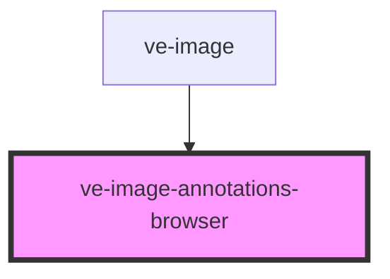

# ve-entities

<!-- Auto Generated Below -->

## Properties

| Property      | Attribute     | Description | Type     | Default     |
| ------------- | ------------- | ----------- | -------- | ----------- |
| `annotations` | `annotations` |             | `string` | `undefined` |

## Events

| Event                     | Description | Type                  |
| ------------------------- | ----------- | --------------------- |
| `closeAnnotationsBrowser` |             | `CustomEvent<any>`    |
| `zoomToRegion`            |             | `CustomEvent<string>` |

## Dependencies

### Used by

 - [ve-image](../ve-image)

### Graph

----------------------------------------------

*Built with [StencilJS](https://stenciljs.com/)*
