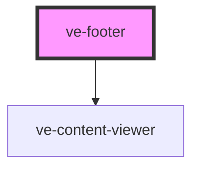

# ve-entities

<!-- Auto Generated Below -->

## Properties

| Property | Attribute | Description | Type      | Default     |
| -------- | --------- | ----------- | --------- | ----------- |
| `sticky` | `sticky`  |             | `boolean` | `undefined` |

## Dependencies

### Depends on

- [ve-content-viewer](../ve-content-viewer)

### Graph

----------------------------------------------

*Built with [StencilJS](https://stenciljs.com/)*
