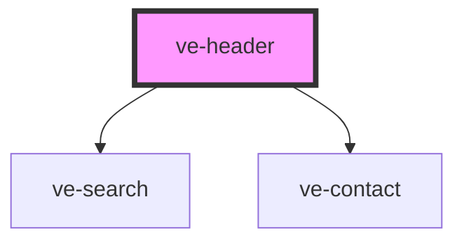

# ve-header

<!-- Auto Generated Below -->

## Properties

| Property        | Attribute        | Description | Type      | Default     |
| --------------- | ---------------- | ----------- | --------- | ----------- |
| `background`    | `background`     |             | `string`  | `undefined` |
| `contact`       | `contact`        |             | `string`  | `undefined` |
| `entities`      | `entities`       |             | `string`  | `undefined` |
| `height`        | `height`         |             | `number`  | `300`       |
| `label`         | `label`          |             | `string`  | `undefined` |
| `logo`          | `logo`           |             | `string`  | `undefined` |
| `options`       | `options`        |             | `string`  | `undefined` |
| `position`      | `position`       |             | `string`  | `'center'`  |
| `searchCx`      | `search-cx`      |             | `string`  | `undefined` |
| `searchDomain`  | `search-domain`  |             | `string`  | `undefined` |
| `searchFilters` | `search-filters` |             | `string`  | `undefined` |
| `sticky`        | `sticky`         |             | `boolean` | `undefined` |
| `subtitle`      | `subtitle`       |             | `string`  | `undefined` |

## Dependencies

### Depends on

- [ve-search](../ve-search)
- [ve-contact](../ve-contact)

### Graph

----------------------------------------------

*Built with [StencilJS](https://stenciljs.com/)*
