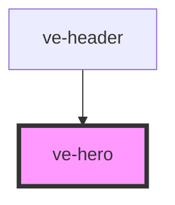

# ve-header

<!-- Auto Generated Below -->

## Properties

| Property     | Attribute    | Description | Type      | Default     |
| ------------ | ------------ | ----------- | --------- | ----------- |
| `background` | `background` |             | `string`  | `undefined` |
| `height`     | `height`     |             | `number`  | `300`       |
| `options`    | `options`    |             | `string`  | `undefined` |
| `position`   | `position`   |             | `string`  | `'center'`  |
| `sticky`     | `sticky`     |             | `boolean` | `undefined` |
| `top`        | `top`        |             | `number`  | `0`         |

## Dependencies

### Used by

 - [ve-header](../ve-header)

### Graph

----------------------------------------------

*Built with [StencilJS](https://stenciljs.com/)*
