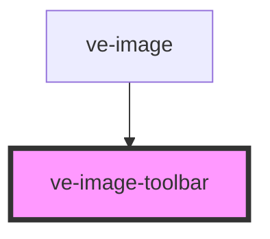

# ve-entities

<!-- Auto Generated Below -->

## Properties

| Property         | Attribute         | Description | Type      | Default |
| ---------------- | ----------------- | ----------- | --------- | ------- |
| `canEdit`        | `can-edit`        |             | `boolean` | `false` |
| `hasAnnotations` | `has-annotations` |             | `boolean` | `false` |

## Events

| Event         | Description | Type                  |
| ------------- | ----------- | --------------------- |
| `iconClicked` |             | `CustomEvent<string>` |

## Dependencies

### Used by

 - [ve-image](../ve-image)

### Graph

----------------------------------------------

*Built with [StencilJS](https://stenciljs.com/)*
