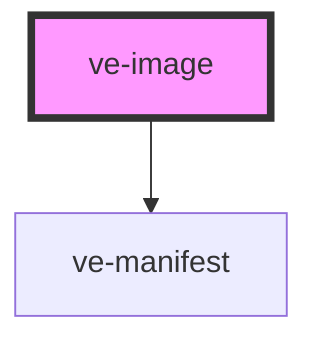

# ve-image-viewer

<!-- Auto Generated Below -->

## Properties

| Property    | Attribute    | Description | Type     | Default     |
| ----------- | ------------ | ----------- | -------- | ----------- |
| `align`     | `align`      |             | `string` | `undefined` |
| `alt`       | `alt`        |             | `string` | `undefined` |
| `annoBase`  | `anno-base`  |             | `string` | `undefined` |
| `authToken` | `auth-token` |             | `string` | `null`      |
| `compare`   | `compare`    |             | `string` | `undefined` |
| `entities`  | `entities`   |             | `string` | `undefined` |
| `fit`       | `fit`        |             | `string` | `undefined` |
| `height`    | `height`     |             | `string` | `undefined` |
| `options`   | `options`    |             | `string` | `undefined` |
| `path`      | `path`       |             | `string` | `undefined` |
| `seq`       | `seq`        |             | `number` | `undefined` |
| `src`       | `src`        |             | `string` | `undefined` |
| `user`      | `user`       |             | `string` | `null`      |
| `width`     | `width`      |             | `string` | `'40%'`     |

## Dependencies

### Depends on

- [ve-manifest](../ve-manifest)

### Graph

----------------------------------------------

*Built with [StencilJS](https://stenciljs.com/)*
