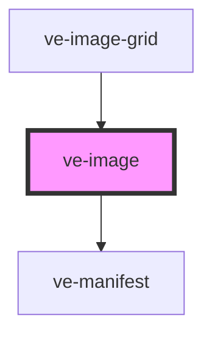

# ve-image-viewer

<!-- Auto Generated Below -->

## Properties

| Property       | Attribute        | Description | Type      | Default     |
| -------------- | ---------------- | ----------- | --------- | ----------- |
| `align`        | `align`          |             | `string`  | `undefined` |
| `alt`          | `alt`            |             | `string`  | `undefined` |
| `annoBase`     | `anno-base`      |             | `string`  | `undefined` |
| `compare`      | `compare`        |             | `boolean` | `false`     |
| `entities`     | `entities`       |             | `string`  | `undefined` |
| `fit`          | `fit`            |             | `string`  | `undefined` |
| `height`       | `height`         |             | `string`  | `undefined` |
| `mode`         | `mode`           |             | `string`  | `'default'` |
| `options`      | `options`        |             | `string`  | `undefined` |
| `seq`          | `seq`            |             | `number`  | `1`         |
| `src`          | `src`            |             | `string`  | `undefined` |
| `sticky`       | `sticky`         |             | `boolean` | `undefined` |
| `width`        | `width`          |             | `string`  | `'100%'`    |
| `zoomOnScroll` | `zoom-on-scroll` |             | `boolean` | `false`     |

## Dependencies

### Used by

 - [ve-image-grid](../ve-image-grid)

### Depends on

- [ve-manifest](../ve-manifest)

### Graph

----------------------------------------------

*Built with [StencilJS](https://stenciljs.com/)*
