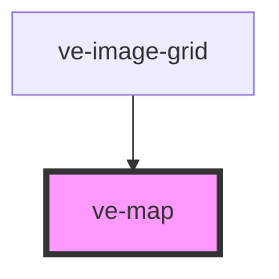

# ve-image-viewer

<!-- Auto Generated Below -->

## Properties

| Property   | Attribute  | Description | Type      | Default     |
| ---------- | ---------- | ----------- | --------- | ----------- |
| `cards`    | `cards`    |             | `string`  | `undefined` |
| `center`   | `center`   |             | `string`  | `undefined` |
| `entities` | `entities` |             | `string`  | `undefined` |
| `height`   | `height`   |             | `string`  | `undefined` |
| `marker`   | `marker`   |             | `string`  | `undefined` |
| `overlay`  | `overlay`  |             | `string`  | `undefined` |
| `sticky`   | `sticky`   |             | `boolean` | `undefined` |
| `width`    | `width`    |             | `string`  | `undefined` |
| `zoom`     | `zoom`     |             | `number`  | `10`        |

## Dependencies

### Used by

 - [ve-image-grid](../ve-image-grid)

### Graph

----------------------------------------------

*Built with [StencilJS](https://stenciljs.com/)*
