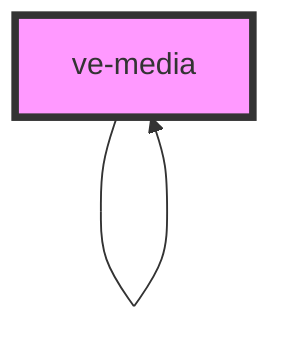

# ve-image-viewer

<!-- Auto Generated Below -->

## Properties

| Property    | Attribute   | Description | Type      | Default     |
| ----------- | ----------- | ----------- | --------- | ----------- |
| `alt`       | `alt`       |             | `string`  | `undefined` |
| `annoBase`  | `anno-base` |             | `string`  | `undefined` |
| `autostart` | `autostart` |             | `boolean` | `false`     |
| `caption`   | `caption`   |             | `string`  | `undefined` |
| `cards`     | `cards`     |             | `boolean` | `false`     |
| `compare`   | `compare`   |             | `boolean` | `false`     |
| `end`       | `end`       |             | `string`  | `undefined` |
| `entities`  | `entities`  |             | `string`  | `undefined` |
| `fit`       | `fit`       |             | `string`  | `undefined` |
| `full`      | `full`      |             | `boolean` | `false`     |
| `grid`      | `grid`      |             | `boolean` | `false`     |
| `height`    | `height`    |             | `string`  | `undefined` |
| `left`      | `left`      |             | `boolean` | `false`     |
| `manifest`  | `manifest`  |             | `string`  | `undefined` |
| `muted`     | `muted`     |             | `boolean` | `true`      |
| `options`   | `options`   |             | `string`  | `undefined` |
| `position`  | `position`  |             | `string`  | `undefined` |
| `right`     | `right`     |             | `boolean` | `false`     |
| `seq`       | `seq`       |             | `number`  | `1`         |
| `start`     | `start`     |             | `string`  | `undefined` |
| `sticky`    | `sticky`    |             | `boolean` | `undefined` |
| `width`     | `width`     |             | `string`  | `undefined` |

## Dependencies

### Used by

 - [ve-media](.)

### Depends on

- [ve-media](.)

### Graph

----------------------------------------------

*Built with [StencilJS](https://stenciljs.com/)*
