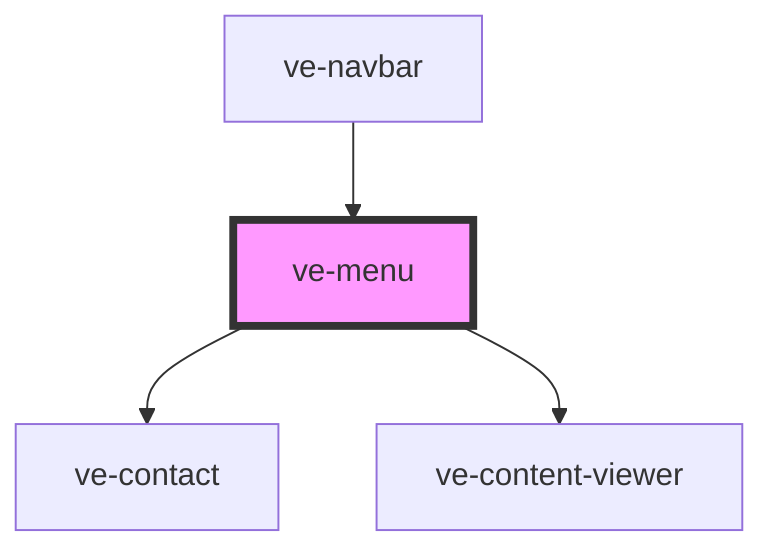

# ve-header

<!-- Auto Generated Below -->

## Properties

| Property     | Attribute    | Description | Type     | Default     |
| ------------ | ------------ | ----------- | -------- | ----------- |
| `background` | `background` |             | `string` | `undefined` |
| `contact`    | `contact`    |             | `string` | `undefined` |
| `position`   | `position`   |             | `string` | `'left'`    |

## Dependencies

### Used by

 - [ve-navbar](../ve-navbar)

### Depends on

- [ve-contact](../ve-contact)
- [ve-content-viewer](../ve-content-viewer)

### Graph

----------------------------------------------

*Built with [StencilJS](https://stenciljs.com/)*
