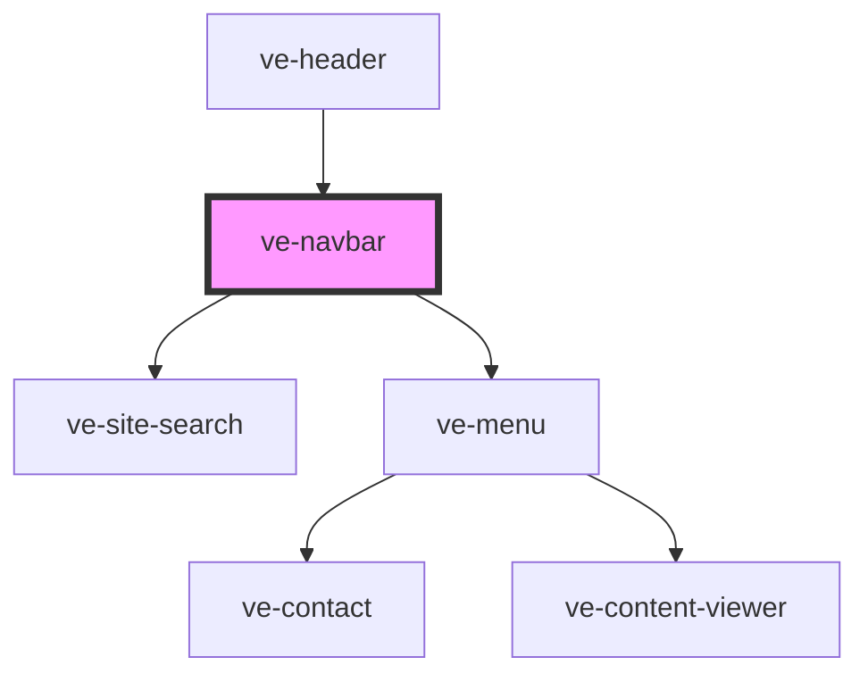

# ve-header

<!-- Auto Generated Below -->

## Properties

| Property       | Attribute       | Description | Type      | Default     |
| -------------- | --------------- | ----------- | --------- | ----------- |
| `alpha`        | `alpha`         |             | `number`  | `undefined` |
| `background`   | `background`    |             | `string`  | `undefined` |
| `contact`      | `contact`       |             | `string`  | `undefined` |
| `height`       | `height`        |             | `number`  | `80`        |
| `label`        | `label`         |             | `string`  | `undefined` |
| `logo`         | `logo`          |             | `string`  | `undefined` |
| `offset`       | `offset`        |             | `number`  | `0`         |
| `searchDomain` | `search-domain` |             | `string`  | `undefined` |
| `sticky`       | `sticky`        |             | `boolean` | `undefined` |
| `subtitle`     | `subtitle`      |             | `string`  | `undefined` |

## Dependencies

### Used by

 - [ve-header](../ve-header)

### Depends on

- [ve-site-search](../ve-site-search)
- [ve-menu](../ve-menu)

### Graph

----------------------------------------------

*Built with [StencilJS](https://stenciljs.com/)*
