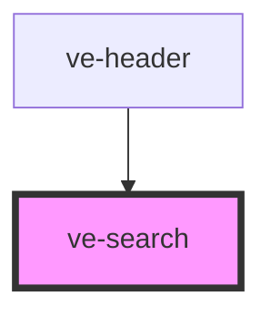

# ve-search

Allows the user to search the site.

## Properties

| Property          | Attribute          | Description                                                                                                                        | Type      | Default     |
| ----------------- | ------------------ | ---------------------------------------------------------------------------------------------------------------------------------- | --------- | ----------- |
| `animationLength` | `animation-length` | How long animation should be when changing from icon to full search bar in seconds                                                 | `string`  | `"0"`       |
| `cx`              | `cx`               | The custom search engine ID, provided by Google                                                                                    | `string`  | `undefined` |
| `icon`            | `icon`             | True if component should be an icon, clicked on to then expand to a search bar, False to start as an icon                          | `boolean` | `false`     |
| `parentComponent` | `parent-component` | Tag name of ve-search's parent tag (required when embedding ve-search into other web components)                                   | `string`  | `""`        |
| `searchDomain`    | `search-domain`    | The domain of the site being searched, e.g. "kent-maps.online"                                                                     | `string`  | `undefined` |
| `searchFilters`   | `search-filters`   | Ways the search results can be filtered, in the format "folderName1:displayName1, ...", e.g. "Jane Austen,dickens:Charles Dickens" | `string`  | `undefined` |
| `tooltip`         | `tooltip`          | The tooltip's text when hovering over the search icon (no tooltip if left blank)                                                   | `string`  | `""`        |

## Dependencies

### Used by

 - [ve-header](../ve-header)

### Graph

----------------------------------------------

*Built with [StencilJS](https://stenciljs.com/)*
