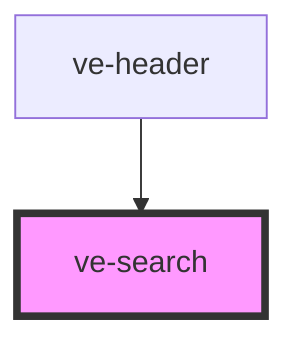

# ve-search

<!-- Auto Generated Below -->

## Properties

| Property          | Attribute          | Description | Type      | Default     |
| ----------------- | ------------------ | ----------- | --------- | ----------- |
| `animationLength` | `animation-length` |             | `string`  | `"0"`       |
| `cx`              | `cx`               |             | `string`  | `undefined` |
| `icon`            | `icon`             |             | `boolean` | `false`     |
| `parentComponent` | `parent-component` |             | `string`  | `""`        |
| `searchDomain`    | `search-domain`    |             | `string`  | `undefined` |
| `searchFilters`   | `search-filters`   |             | `string`  | `undefined` |
| `tooltip`         | `tooltip`          |             | `string`  | `""`        |

## Dependencies

### Used by

 - [ve-header](../ve-header)

### Graph

----------------------------------------------

*Built with [StencilJS](https://stenciljs.com/)*
